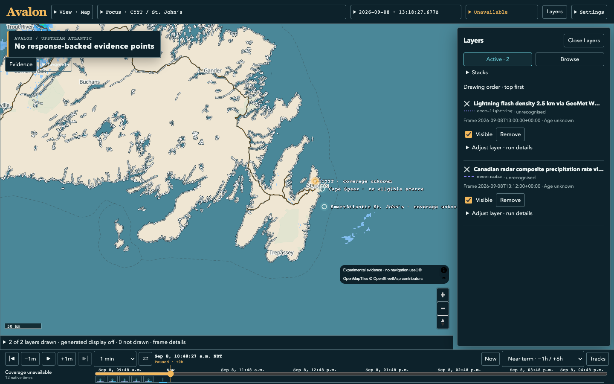
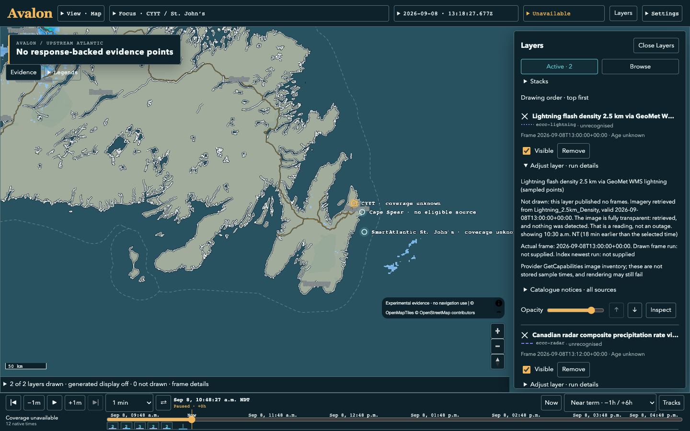
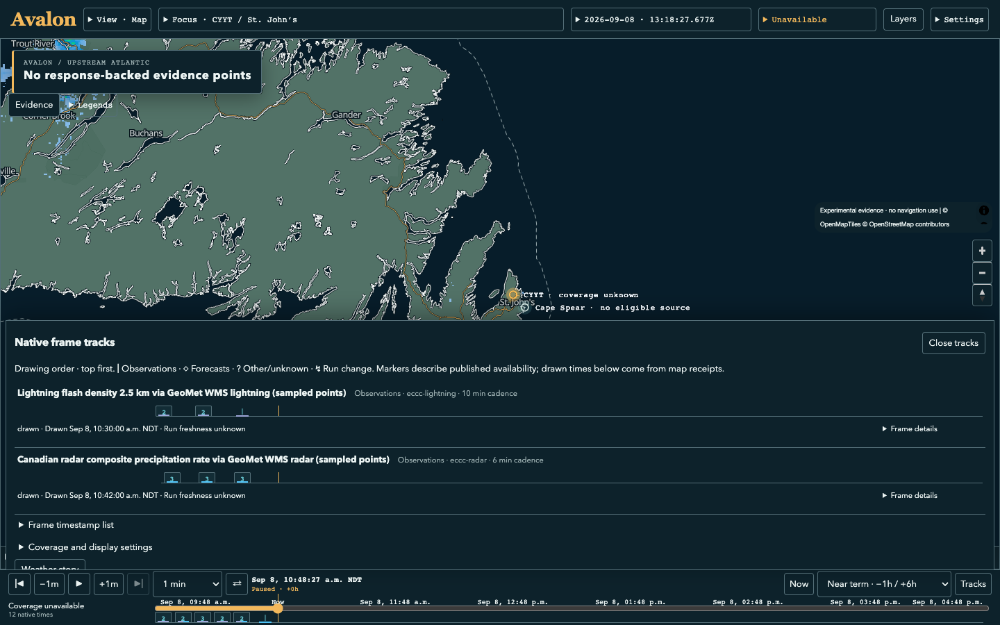

# Catalogue/image time consistency correction, September 8, 2026

The user supplied radar/lightning requests for September 3 frames returning 422
because the API only served September 7 onward. Both failures were reproduced
against the running API before implementation. This correction addresses the
request path, not just the unavailable label.

## Cause and missed coverage

Stored sample axes were copied into the layer catalogue without the final
serving-window intersection. The browser then used that same axis for both
feature requests and WMS images. Its disclosed nearest-frame fallback could
choose a sample five days old. The raster endpoint correctly refused the time.
Existing provider proxies already intersected their inventory with the window;
generic stored layers and other catalogue branches lacked that shared boundary.

Earlier tests checked layers and rendering separately with constructed responses.
They did not exercise an old retained sample through catalogue selection and
actual serving validation. One run-staleness test even expected a frame outside
the serving window. That assertion now distinguishes an old **producer run**
(which must not hide valid frames) from an out-of-window **valid time** (which
must not be advertised as requestable). The previous delivery fix was incomplete.

The main checkout's `make up` did rebuild, but from older source at `9af2aaf`.
It replaced the workbench API image after the previous live check. The new
[workbench runtime targets](../../../experiments/st-johns-weather-map/docs/workbench-runtime.md)
isolate the API image/container at port 8197; frontend port 5197 now proxies it.
The user's regular checkout and uncommitted work were preserved.

## Implementation

- One catalogue boundary clips every producer's sample times, frame records and
  image times to the same API serving window. Run summaries count the surviving
  frames; excluded extents remain explained in notices.
- Recorded GeoMet bindings use the existing bounded, cached GetCapabilities
  reader for their independent image inventory. No provider layer name is
  guessed. Nested producers share the same upstream request budget. A failed or
  malformed inventory cannot take down another layer or manufacture image times.
- Map features resolve only against stored sample times. Images resolve against
  declared image times. Older catalogues also receive a client window guard.
  Timeline markers/snapping include the declared native image times.
- Source IDs, stored artifacts, API schemas, native times, scientific values and
  generated-display rules are unchanged. No scheduled ingestion was introduced.

Spec-Refs: GOV-SPEC-001, GOV-SPEC-002, GOV-SPEC-004, GOV-SPEC-006;
[owner correction and scenarios](../../../experiments/st-johns-weather-map/openspec/changes/desktop-evidence-workbench/specs/web-evidence-interface/spec.md);
[separate image inventory contract](../../../experiments/st-johns-weather-map/openspec/changes/desktop-evidence-api-contract/specs/map-layers/spec.md).

## Actual verification

- 586 frontend tests pass; production build passes with the existing bundle-size warning.
- 152 affected backend tests pass, including all catalogue branches, exact window
  boundaries, rollover, differing sample/image axes, provider inventory failure,
  malformed inventory isolation, shared budgets, run attribution and GFS cache axes.
- Four new frontend regressions were observed red before the change: stale
  fallback, image-only native markers, current image vs old samples, and unknown
  image inventory. The two original API repro regressions were also observed red.
- Strict OpenSpec and specctl pass, with zero specctl errors/warnings. Compose
  overlay validation and `make workbench-api-up` pass.
- [Live image audit](image-probes.json): all five catalogue variants checked;
  zero out-of-window axes; all 23 available 256×256 image probes returned HTTP
  200 with image/png and returned native frame times. These bounded probes cover
  provider proxies, recorded observation bindings and currently available GFS
  demand cloud images. They do not certify every future provider request.
- [Final catalogue audit](final-catalogue.json): repeated after the final API build.
- Actual Chrome drew radar at 13:12Z and lightning at 13:00Z with zero feature
  requests for those image-only frames and zero September 3 requests. Unrelated
  point/API panels were explicitly unavailable to bound this live check. Small or
  transparent successful images are retrieved display results, not missing data.
- Map-first and timeline Chrome proofs pass again: all three viewport sizes,
  themes, native 200% zoom, native markers, saved stacks, focus and camera/URL
  preservation. Receipts are included; full fresh matrices remain in
  `/tmp/astraeus-serving-map-proof` and `/tmp/astraeus-serving-timeline-proof`.

The full backend suite was also attempted: 2,944 passed, 86 skipped, 22 failures
and 10 errors. One GFS catalogue test needed its clock pinned after window
filtering; it now passes in the 152-test affected suite. The other 21 failures
and 10 errors reproduced against unchanged `97f15d7` source using the same local
Python environment. They include stale fixture clocks, Linux-worker/platform and
missing ecCodes support. [Exact baseline comparison](backend-baseline-comparison.json).
A completely green full backend suite is **not** claimed.

## Live browser evidence

[Request/response receipt](live-browser/receipt.json). Source evidence classes
that the API does not declare remain unrecognised. No field classification,
lightning strike count, rainfall rate or historical observation is invented from
pixels. #38 remains open for owner visual acceptance.
