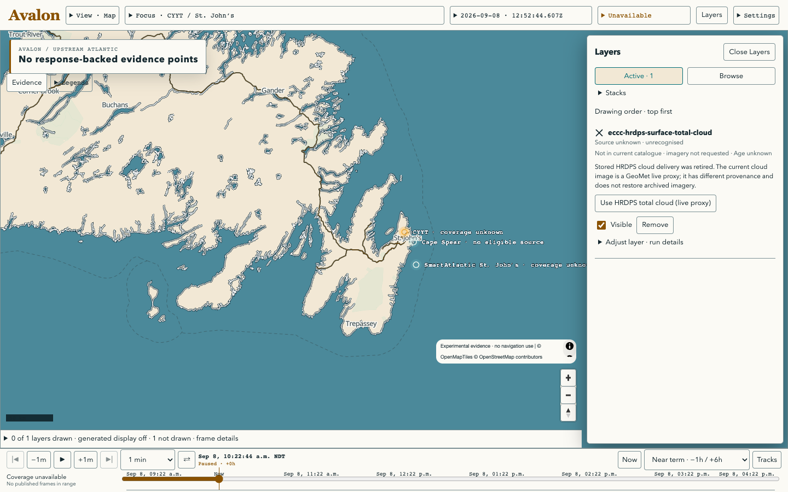
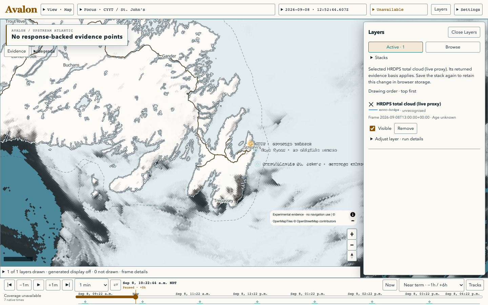

# Current layer defaults and failure diagnosis, September 8, 2026

The owner requested fixing the widespread stale-layer problem. The Nowcast
stack now uses the current HRDPS cloud proxy and selected-time CAP delivery.
GOES natural colour, radar and lightning retain their declared identities.
Linked and browser-saved selections do not silently change. A known supported
replacement is offered explicitly and preserves order, visibility and opacity.

The shared feature loader previously treated HTTP 200 plus an empty feature
array as success even when the body declared `unavailable`. It now fails closed
on unavailable, missing or unknown data modes and retains the API notices.
A successful empty collection has a distinct empty draw receipt and “No features
returned” label. Layer details/Inspect expose catalogue status, notices and the
actual draw reason. Cache hits are never inferred from an HTTP 200 or a cache
policy header.

Spec-Refs: GOV-SPEC-001, GOV-SPEC-002, GOV-SPEC-004, GOV-SPEC-006;
[desktop stack contract](../../../experiments/st-johns-weather-map/openspec/changes/desktop-evidence-workbench/specs/web-evidence-interface/spec.md);
[evidence truth boundary](../../../experiments/st-johns-weather-map/openspec/specs/evidence-truth-boundary/spec.md).

## Verification

- `npm test`: 582 tests pass in 41 files, including eight GPU tests.
- `npm run build`: passes; existing large-bundle warning remains.
- `openspec validate desktop-evidence-workbench --strict`: passes from experiment root.
- `uv run --project tools/specs python tools/specs/specctl.py validate`: zero errors/warnings.
- `BENCH_PROOF_DIR=/tmp/astraeus-layer-repair-final-proof node scripts/prove-map-first.mjs`: passes. The [77-file constructed proof](constructed/) includes all three desktop sizes, all themes, native 200% zoom, focus return, saved stacks, all five views, camera preservation, failure states and explicit repair/URL restoration. These are constructed feature responses with live reference tiles, not provider captures.
- `node scripts/prove-timeline.mjs`: passes again after stamping feature fixtures with their required data mode. The unchanged timeline retains 38 captures in the local proof output; its latest receipt is included here.
- `node scripts/prove-layer-repair-live.mjs`: passes in actual Chrome. Two live catalogue calls and one actual HRDPS raster request; unrelated API panels are explicitly withheld to bound acquisition. The [receipt](live/receipt.json) records HTTP 200, a 291,294-byte PNG, native valid time 2026-09-08T13:00:00Z, provider run 06:00Z and `live_proxy` evidence basis. No imagery request was made for the retired ID.

The tests were observed failing before the implementation: stale default,
missing repair/state controls and HTTP-200 unavailable responses lost their
reason. Focus, duplicate replacement refusal, saved-stack preservation and actual
empty-vs-unavailable draw receipts are covered by regression tests.

## Live result and limits

Before accepting the replacement (updated UI, old linked ID):

After accepting it, actual cloud imagery is drawn:

[Expanded actual frame details](live/live-cloud-details.png).
These screenshots deliberately mark unrelated point panels unavailable. They do
not prove point forecasts, radar or lightning acquisition.

The local API image was older than current merged source: it lacked current CAP
catalogue handling and source mappings. It was rebuilt from this worktree and
recreated using the existing local Compose configuration, without changing data
volumes. A later live-browser attempt hit a 45-second catalogue timeout; a direct
health request also timed out while the API consumed one CPU. Restarting the
API allowed the bounded proof to pass. This is an unresolved runtime stall,
not a proven permanent performance repair.

The [separate API checks](live-api-check.json) show successful current CAP
retrieval with all declared boxes successful, zero alerts and an explicitly valid
empty answer. Its subsequent catalogue read explicitly reports a fresh source-local
cache entry without another provider request. The cloud PNG check succeeded in
0.68 seconds. Cloud `Cache-Control` does not establish whether upstream bytes
came from cache, so no upstream cache-hit claim is made.

The local radar and lightning catalogue frames end on September 3, well before
this September 8 check. Their IDs still exist; this is stale provider/store
coverage, not the retired-cloud identity bug. No background ingestion or new
source delivery has been introduced. Source-completion work remains under #70.
The API still omits evidence-class values for some layers; the UI preserves
“unrecognised” instead of inventing a classification. #38 remains open for owner
visual acceptance.
